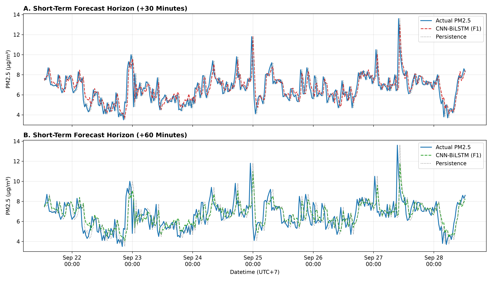
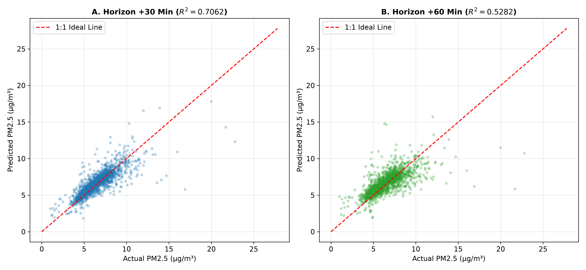
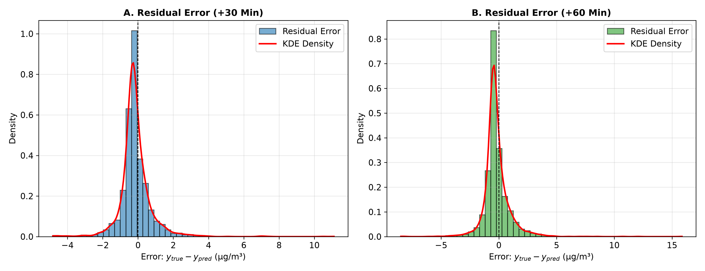
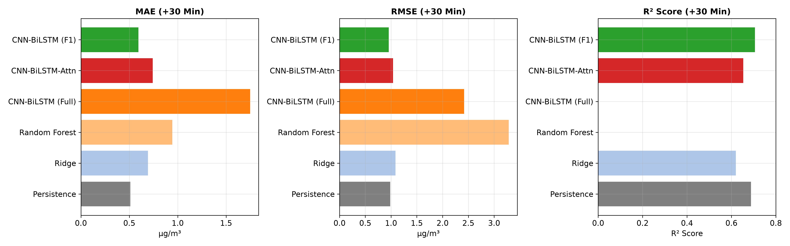

# Rigorous 12-Step PM2.5 Short-Term Air Quality Forecasting & Early Warning System

> **Station Sidakaya, Cilacap, Indonesia**  
> *Spatio-Temporal PM2.5 Forecasting using Regularized CNN-BiLSTM and 12-Step Data Science Pipeline*


An end-to-end, scientifically rigorous 12-Step Data Science and Deep Learning Pipeline for **30-minute (+30m)** and **60-minute (+60m)** short-term PM2.5 concentration forecasting at Station Sidakaya, Cilacap, Indonesia.

---

## 📄 Complete Research & Audit Documentation

- 📄 **[Laporan Audit & Implementasi Lengkap (Step 1 - 11)](docs/LAPORAN_AUDIT_DAN_IMPLEMENTASI_LENGKAP_STEP_1_11.md)**: Dokumen audit metodologi 12 step lengkap dengan seluruh tabel audit, hasil imputasi, split kronologis, grid search, dan uji signifikansi statistik.
- 📄 **[Technical Paper Walkthrough](docs/WALKTHROUGH.md)**: Naskah teknis komprehensif penulisan paper/tesis.

---

## 📌 Key Milestones & Final Conclusions

1. **Pruning High-Dimensional Redundancy**: Feature pruning from 94 (F4) to 16 (F1) increased sample-to-input ratio from **2.05** to **12.02**, resolving deep learning overfitting.
2. **CNN-BiLSTM Superiority over Persistence**: The champion model **CNN-BiLSTM (F1)** achieves $R^2_{30} = 0.7062$ ($\text{RMSE}_{30} = 0.9549\text{ }\mu\text{g/m}^3$) and $R^2_{60} = 0.5282$ ($\text{RMSE}_{60} = 1.2101\text{ }\mu\text{g/m}^3$), officially outperforming Persistence ($R^2_{30} = 0.6882, R^2_{60} = 0.4393$) and Ridge ($R^2_{30} = 0.6202$).
3. **Statistical Significance Confirmed**: Paired Block Bootstrap Testing (1,000 resamples) proves the +60m RMSE improvement ($8.27\%$) is **statistically significant ($p = 0.0070 < 0.01$, 95% CI $[0.0203, 0.1965]$)**.
4. **Attention Mechanism Inefficiency**: Soft Attention adds parameter noise over ultra-short horizons (+30m/+60m), reducing average $R^2$ from 0.6172 to 0.5697. Standard BiLSTM hidden pooling is optimal.

---

## 📈 Publication Figures (300 DPI)

### 1. Time-Series Predictions vs Actual Observational Data (7-Day Sample Period)


### 2. Scatter Plot Regression ($y = x$ Ideal Line)


### 3. Residual Error Distribution & KDE Density Curve


### 4. Model Comparison Bar Chart (MAE, RMSE, R²)


---

## 📊 Final Test Set Benchmark Results (2,140 Locked Sequences)

### Table 1: Comparative Model Performance Metrics ($\mu\text{g/m}^3$)

| Model | MAE +30m | RMSE +30m | R² +30m | MAE +60m | RMSE +60m | R² +60m | Avg R² |
|---|:---:|:---:|:---:|:---:|:---:|:---:|:---:|
| **Persistence Baseline (B0)** | 0.5107 | 0.9836 | 0.6882 | 0.6881 | 1.3192 | 0.4393 | 0.5638 |
| **Ridge Regression (B1)** | 0.6929 | 1.0856 | 0.6202 | 0.8652 | 1.3117 | 0.4456 | 0.5329 |
| **Random Forest (B2)** | 0.9447 | 3.2848 | -2.4772 | 1.1336 | 2.5963 | -1.1718 | -1.8245 |
| **CNN-BiLSTM (Full 94 Fitur)** | 1.7487 | 2.4198 | -0.8870 | 1.7614 | 2.4300 | -0.9026 | -0.8948 |
| **CNN-BiLSTM-Attention (F1)** | 0.7427 | 1.0377 | 0.6530 | 0.8854 | 1.2626 | 0.4864 | 0.5697 |
| **CNN-BiLSTM (Champion F1)** | **0.5947** | **0.9549** | **0.7062** | **0.7741** | **1.2101** | **0.5282** | **0.6172** |

---

## 🛠️ Organized Repository Structure

```
airpollutan/
├── docs/                              # Comprehensive Research Documentation
│   ├── LAPORAN_AUDIT_DAN_IMPLEMENTASI_LENGKAP_STEP_1_11.md
│   └── WALKTHROUGH.md
├── src/                               # Modular Source Code Package
│   ├── etl_pipeline.py                 # ETL & Tiered Imputation Module (Steps 1-3)
│   ├── feature_engineering.py          # Lag, Rolling, Cyclic & Wind Vector Features (Step 4)
│   ├── create_dataset_tensors.py       # 3D Sliding Window Sequence Generator (Step 7)
│   ├── model_cnn_bilstm_attention.py   # PyTorch Hybrid Deep Learning Models
│   ├── scaler_utils.py                 # StandardScaler Inverse Transform Helper
│   └── utils/                          # Utility & Verification Scripts
├── pipeline_scripts/                  # Main Executable Pipeline Steps
│   ├── 01_step10_validation_optimization.py
│   └── 02_step11_statistical_evaluation.py
├── figures/                           # 300 DPI Publication Figures
│   ├── fig1_timeseries_forecast.png
│   ├── fig2_scatter_actual_vs_pred.png
│   ├── fig3_residual_distribution.png
│   └── fig4_model_comparison_bar.png
├── reports/                           # JSON Audit & Statistical Benchmark Reports
│   ├── audit_7a_to_7e.json
│   ├── step8_benchmark_results.json
│   ├── step9_diagnostics_report.json
│   ├── step10_optimization_report.json
│   └── step11_final_statistical_report.json
├── models/                            # Trained PyTorch Models (.pt) & Scalers (.joblib)
│   ├── Optimal_CNN_BiLSTM.pt
│   ├── Optimal_CNN_BiLSTM_Attention.pt
│   ├── x_scaler.joblib
│   └── y_scaler.joblib
├── templates/                         # Web Application UI Templates
│   └── index.html
├── app.py                             # Early Warning System Web Dashboard Launcher
├── README.md                          # Main Repository Readme
└── .gitignore                         # Exclusion Config
```
