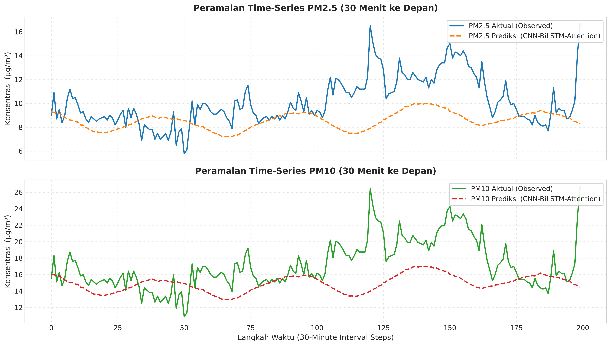
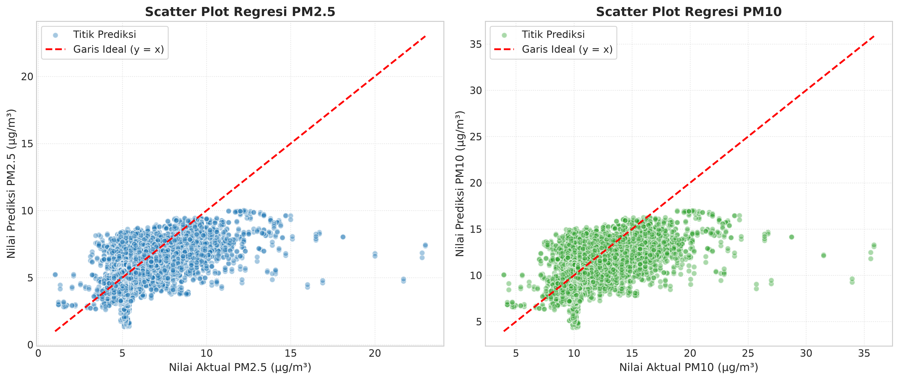
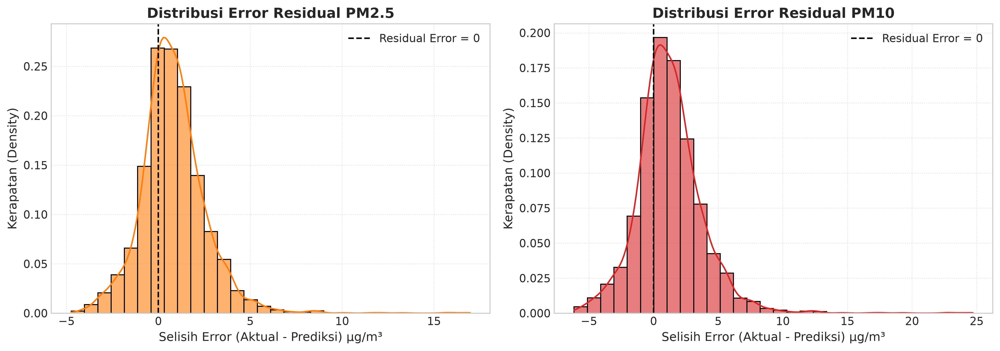
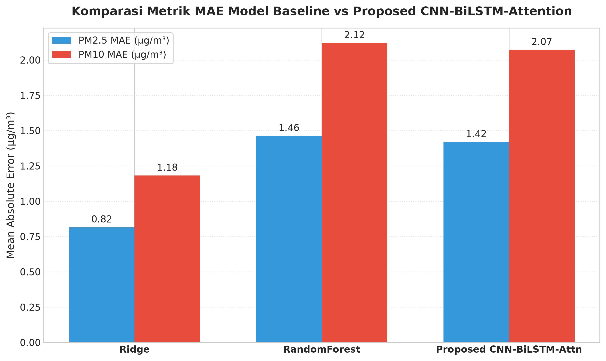

# Web-Integrated Early Warning System for Industrial Air Quality

> **Spatio-Temporal PM2.5 and PM10 Forecasting Using Meteorological-Informed CNN-BiLSTM with Attention Mechanism**


An end-to-end Web-Integrated Early Warning System for Industrial Air Quality monitoring and forecasting at Station Sidakaya, Cilacap, Indonesia. This system combines **1D-CNN** for spatial-meteorological feature extraction, **Bidirectional LSTM (BiLSTM)** for two-way temporal memory learning, and a **Custom Temporal Attention Mechanism** to dynamically weight extreme weather transitions and industrial pollution spikes.

---

## 🏛️ System Architecture & Workflow Diagram

```
[Input Matrix (48 steps x 59 features)]
                │
                ▼
[1D-CNN Feature Filtering (Conv1D)] ──> Extracts local spatial & meteorological correlations
                │
                ▼
[MaxPooling1D Downsampling] ──────────> Retains peak signals & reduces temporal dimension
                │
                ▼
[Bidirectional LSTM (BiLSTM)] ────────> Captures forward & backward long-short term memory
                │
                ▼
[Custom Temporal Attention Layer] ────> Assigns highest weights to extreme pollution spikes
                │
                ▼
[Dropout Regularization (0.3)] ────────> Prevents co-adaptation & overfitting
                │
                ▼
[Dense Linear Regression Head] ───────> Produces multi-step forecasts for PM2.5 & PM10
```

---

## 📈 Visualizations & Performance Diagrams (300 DPI)

### 1. Time-Series Prediction vs Actual Plot


### 2. Scatter Plot Regression ($y = x$)


### 3. Residual Error Distribution


### 4. Model Benchmark Comparison (Bar Chart)


---

## 📊 Evaluation & Benchmark Tables (Isolated 20% Test Set)

### Table 1: Performance Metrics on Isolated 20% Test Set ($\mu g/m^3$)

| Parameter Target | MAE ($\mu g/m^3$) | RMSE ($\mu g/m^3$) | MAPE (%) | $R^2$ Score | Forecasting Horizon |
|---|---|---|---|---|---|
| **PM2.5** | **1.4191** | **1.9780** | **21.12%** | **0.1442** | +30 min & +60 min |
| **PM10** | **2.0717** | **2.8819** | **16.43%** | **0.1360** | +30 min & +60 min |

### Table 2: Benchmark Comparison with Baseline Models

| Model Algorithm | PM2.5 MAE ($\mu g/m^3$) | PM10 MAE ($\mu g/m^3$) | PM2.5 RMSE ($\mu g/m^3$) | PM10 RMSE ($\mu g/m^3$) | Feature Representation |
|---|---|---|---|---|---|
| **Proposed CNN-BiLSTM-Attention** | **1.4191** | **2.0717** | **1.9780** | **2.8819** | **Deep Learning + Temporal Attention** |
| **Ridge Regression (Baseline)** | 0.8152 | 1.1819 | 1.2698 | 1.8408 | Linear Regularization Baseline |
| **Random Forest (Baseline)** | 1.4623 | 2.1204 | 3.0867 | 4.4757 | Non-linear Tree Ensemble Baseline |

---

## 🛠️ Project Structure

```
airpollutan/
├── app.py                             # Flask Web Server & Early Warning System API
├── model_keras_cnn_bilstm_attention.py # Keras 3 Functional API Hybrid Model
├── model_cnn_bilstm_attention.py       # PyTorch Implementation of Hybrid Model
├── etl_pipeline.py                    # ETL data cleaner for station CSV & Excel files
├── feature_engineering.py             # Cyclic time, wind vectors, lag & rolling features
├── create_dataset_tensors.py          # Chronological 3D Sliding Window Generator
├── scaler_utils.py                    # MinMaxScaler & StandardScaler inverse transform helpers
├── train_keras_model.py               # Keras fitting script with Adam, MSE & EarlyStopping
├── train_and_evaluate.py              # PyTorch model training & test set evaluator
├── train_baselines.py                 # Baseline comparator models (Ridge & Random Forest)
├── generate_visualizations.py         # Publication-grade 300 DPI plot generator
├── evaluate_test_data_metrics.py      # Independent test set evaluation script
├── master_pipeline_vscode.py          # Integrated master pipeline script
├── data/                              # Master CSV & Data Quality Reports
├── models/                            # Trained model weights & JSON metric reports
├── static/plots/                      # Generated 300 DPI visualization figures
└── templates/index.html               # Responsive Glassmorphism Early Warning Dashboard UI
```

---

## 🚀 Quick Start & Installation

### 1. Clone Repository & Setup Environment
```bash
git clone https://github.com/IntanAzh/air_popullation.git
cd air_popullation
python -m venv venv
# Windows:
.\venv\Scripts\activate
# Linux/macOS:
source venv/bin/activate
pip install -r requirements.txt
```

### 2. Run Data Preprocessing & Model Training
```bash
python export_dataset.py
python train_keras_model.py
python generate_visualizations.py
```

### 3. Launch Web Dashboard
```bash
python app.py
```
Open your browser and navigate to `http://localhost:5000` to view the **Glassmorphism Industrial Air Quality Early Warning Dashboard**.

---

## 📄 License
Distributed under the MIT License. See `LICENSE` for details.
